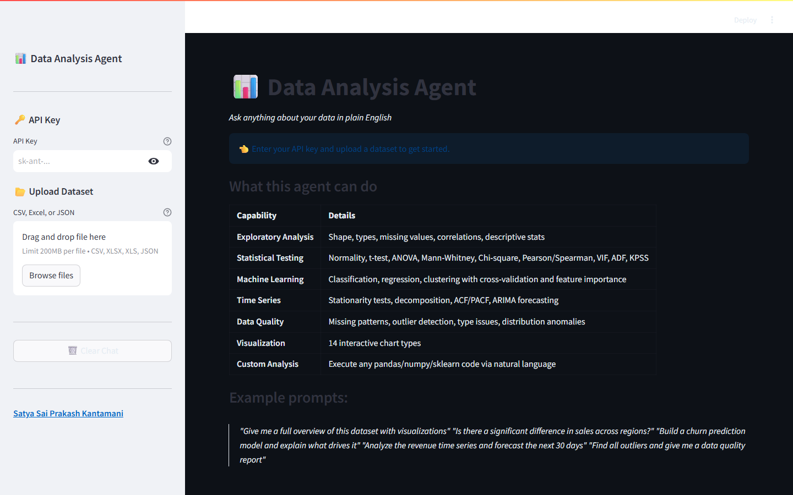

# Data Analysis AI Agent

> An autonomous LLM-powered agent that understands natural language, performs rigorous statistical analysis, builds ML models, generates interactive visualizations, and delivers actionable business insights — all in a conversational interface.



*The landing UI — enter an Anthropic API key in the sidebar, upload a CSV/Excel/JSON file, and ask questions in plain English.*

---

## Overview

Traditional data analysis requires writing code for every query. This agent **understands natural language**, autonomously decides what to compute, **writes and executes Python**, and returns interactive charts + statistically rigorous insights — no coding required.

### Key Features
- **7 specialized tools** — exploration, code execution, statistical testing, charting, ML modeling, time series analysis, and data quality assessment
- **Statistical rigor** — normality checks before parametric tests, effect sizes alongside p-values, assumption verification
- **Interactive Plotly charts** — 14 chart types with dark theme, hover tooltips, and zoom
- **ML pipeline** — classification, regression, and clustering with baseline comparison, stratified k-fold CV, and feature importance
- **Time series suite** — stationarity testing (ADF + KPSS), STL decomposition, ACF/PACF, ARIMA forecasting
- **Data quality engine** — missing value classification (MCAR/MAR/MNAR), outlier detection, type validation, distribution anomalies
- **Conversation memory** — multi-turn analysis with full context retention
- **CSV, Excel, JSON upload** — bring any tabular dataset

---

## How It Works (Tool-Calling Agent Loop)

```
User: "Is there a significant difference in sales across regions?"
         │
         ▼
    ┌─────────────┐
    │   REASON    │  LLM decides: "I need to explore data, check normality,
    │             │   then run ANOVA or Kruskal-Wallis, and visualize"
    └──────┬──────┘
           │
           ▼
    ┌─────────────┐
    │  TOOL CALL  │  explore_data → statistical_test(normality) →
    │             │  statistical_test(anova) → create_chart(box)
    └──────┬──────┘
           │
           ▼
    ┌─────────────┐
    │   OBSERVE   │  Gets results from each tool call
    └──────┬──────┘
           │
    (repeats until complete)
           │
           ▼
    Final Answer: Statistical findings + charts + business interpretation
```

---

## Tech Stack

| Component        | Technology                                          |
|-----------------|-----------------------------------------------------|
| LLM             | Anthropic Claude (via LangChain)                    |
| Agent Framework | LangChain Tool-Calling Agent + AgentExecutor        |
| Tools           | 7 custom tools (explore, code, stats, chart, ML, time series, quality) |
| Data Processing | pandas, NumPy                                       |
| Statistics      | SciPy, statsmodels                                  |
| Machine Learning| scikit-learn, XGBoost                               |
| Visualization   | Plotly (interactive), Matplotlib, Seaborn            |
| UI              | Streamlit                                           |
| Code Execution  | Python exec() with restricted builtins (see security note below) |

> **Security note:** the restricted-builtins `exec()` used for code execution is **not a real security sandbox** — a filtered `__builtins__` dict is trivially escapable by determined code. It only guards against accidental misuse by LLM-generated code. If you run this app with untrusted users or untrusted input, execute the generated code in an isolated subprocess or container instead.

---

## Getting Started

### 1. Clone the repository
```bash
git clone https://github.com/Kantamaniprakash/data-analysis-agent.git
cd data-analysis-agent
```

### 2. Install dependencies

With [uv](https://docs.astral.sh/uv/) (recommended — reproducible via the committed `uv.lock`):
```bash
uv sync --locked
```

Or with pip:
```bash
pip install -r requirements.txt
```

### 3. Run the app
```bash
uv run streamlit run agent.py   # or: streamlit run agent.py
```

### 4. Enter your API key in the sidebar and upload a dataset

---

## Usage

1. Open `http://localhost:8501`
2. Enter your Anthropic API key in the sidebar
3. Upload a CSV, Excel, or JSON file
4. Type your analysis request in plain English
5. The agent reasons through the problem and returns insights + charts

### Example Prompts
- *"Give me a full overview of this dataset with visualizations"*
- *"Is there a significant difference in sales across regions?"*
- *"Build a churn prediction model and explain what drives it"*
- *"Analyze the revenue time series and forecast the next 30 days"*
- *"Find all outliers and give me a data quality report"*
- *"What's the correlation between price and quantity? Is it statistically significant?"*
- *"Segment customers using clustering and profile each cluster"*

---

## Project Structure

```
data-analysis-agent/
├── agent.py            # Main Streamlit app + LangChain agent + all 7 tools
├── pyproject.toml      # Project metadata + dependencies (PEP 621)
├── uv.lock             # Locked, reproducible dependency resolution
├── requirements.txt    # Pip-compatible dependency floors
├── tests/
│   └── test_smoke.py   # Smoke tests (files exist, source parses)
├── docs/
│   └── screenshot.png  # Landing UI screenshot
├── .env.example        # Template for required environment variables
├── .github/            # CI workflow + Dependabot config
├── LICENSE
└── README.md
```

---

## Agent Tools

| Tool               | Description                                                                 |
|-------------------|-----------------------------------------------------------------------------|
| `explore_data`    | Comprehensive EDA: shape, types, missing values, descriptive stats with skewness/kurtosis, correlations, duplicates |
| `run_code`        | Execute any Python code on the DataFrame (pandas, NumPy, sklearn, etc.)     |
| `statistical_test`| 15+ tests: normality (Shapiro/D'Agostino/KS), t-test, Mann-Whitney, ANOVA, Kruskal-Wallis, chi-square, Pearson/Spearman correlation, VIF, ADF, KPSS, Durbin-Watson |
| `create_chart`    | 14 interactive Plotly chart types: histogram, bar, line, scatter, box, violin, heatmap, pie, area, treemap, scatter matrix, 2D density, time series |
| `train_model`     | ML pipeline: classification, regression, clustering with baseline comparison, stratified k-fold CV, feature importance charts |
| `analyze_time_series` | Stationarity (ADF+KPSS), STL decomposition, ACF/PACF, rolling stats, ARIMA forecasting with confidence intervals |
| `data_quality`    | Missing value classification (MCAR/MAR/MNAR), IQR outlier detection, type validation, distribution anomalies, duplicate analysis |

---

## Statistical Tests Available

| Test | Method | When to Use |
|------|--------|-------------|
| Normality | Shapiro-Wilk + D'Agostino + KS (consensus) | Before choosing parametric vs non-parametric |
| t-test | Welch's t-test with Levene check | Compare means of 2 groups |
| Mann-Whitney | Rank-based U test | Non-parametric 2-group comparison |
| ANOVA | One-way F-test with eta-squared | Compare means across 3+ groups |
| Kruskal-Wallis | Non-parametric ANOVA | Non-normal 3+ group comparison |
| Chi-square | Contingency with Cramer's V | Association between categoricals |
| Pearson | Correlation with 95% CI | Linear relationship strength |
| Spearman | Rank correlation | Monotonic relationship strength |
| VIF | Variance Inflation Factor | Multicollinearity detection |
| ADF / KPSS | Stationarity tests | Time series modeling readiness |
| Durbin-Watson | Autocorrelation test | Regression residual check |

---

## Results & Limitations

### What is verified

- **CI-tested on Python 3.10 / 3.11 / 3.12** — every push runs the smoke test suite (source parses, key files present, `safe_exec` defined) via GitHub Actions.
- **The UI loads without an API key** — the screenshot above is captured from a real headless run of the app; the key is only required once you start an analysis.
- **Statistical outputs are computed, not generated** — p-values, effect sizes, CV scores, and forecasts come from SciPy / statsmodels / scikit-learn, and the LLM only orchestrates and interprets them.

### What is *not* measured

There is no committed benchmark of answer quality: the agent's analysis plans and interpretations depend on the underlying LLM, and no accuracy/eval harness ships with this repo. The "~500K rows" figure sometimes quoted for pandas workloads is a practical guideline, not a measured limit of this app.

### Limitations

- **No answer-quality benchmark** — analysis correctness ultimately depends on the LLM's tool choices; results should be reviewed before driving business decisions.
- **Not a security sandbox** — generated code runs via `exec()` with restricted builtins, which is escapable by determined code (see the security note above). Do not expose the app to untrusted users.
- **Single-machine, in-memory only** — datasets must fit in RAM as a pandas DataFrame; there is no chunking, sampling fallback, or distributed backend.
- **LLM API cost and latency** — every question triggers one or more Claude calls plus tool round-trips; long multi-turn sessions consume tokens accordingly.
- **Conversation memory is session-scoped** — refreshing the Streamlit page clears the chat and any in-memory state.

---

## Future Improvements
- [ ] Add SQL database connectivity (PostgreSQL, Snowflake)
- [ ] Export analysis reports as PDF/HTML
- [ ] Add support for multi-file analysis (joins, comparisons)
- [ ] Integrate Prophet for advanced time series forecasting
- [ ] Deploy to cloud (AWS/GCP)

---

## Author

**Satya Sai Prakash Kantamani** — Data Scientist
[Portfolio](https://kantamaniprakash.github.io) · [GitHub](https://github.com/kantamaniprakash) · [LinkedIn](https://www.linkedin.com/in/prakash-kantamani) · [Email](mailto:prakashkantamani90@gmail.com)
